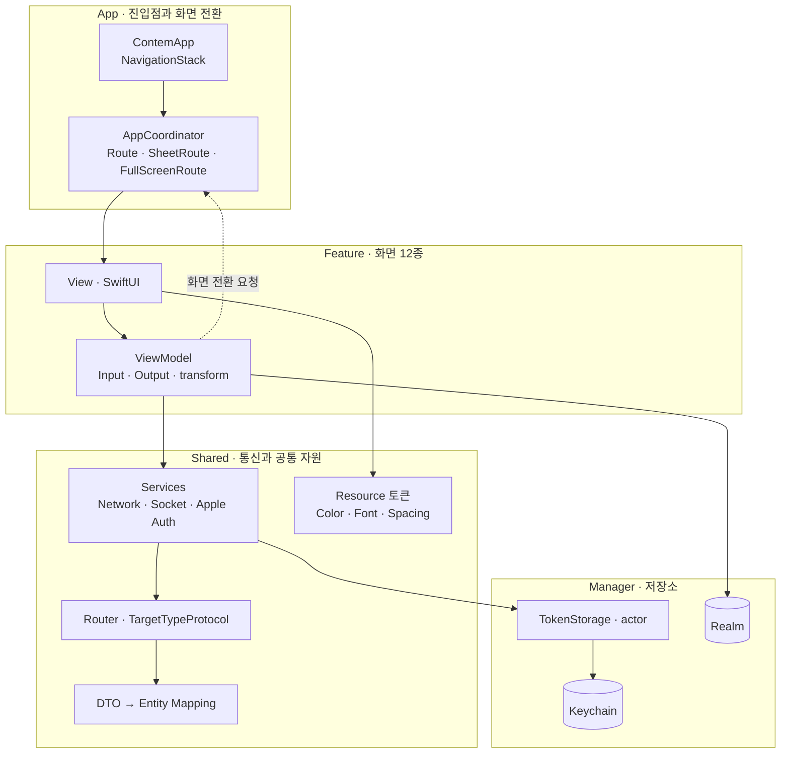
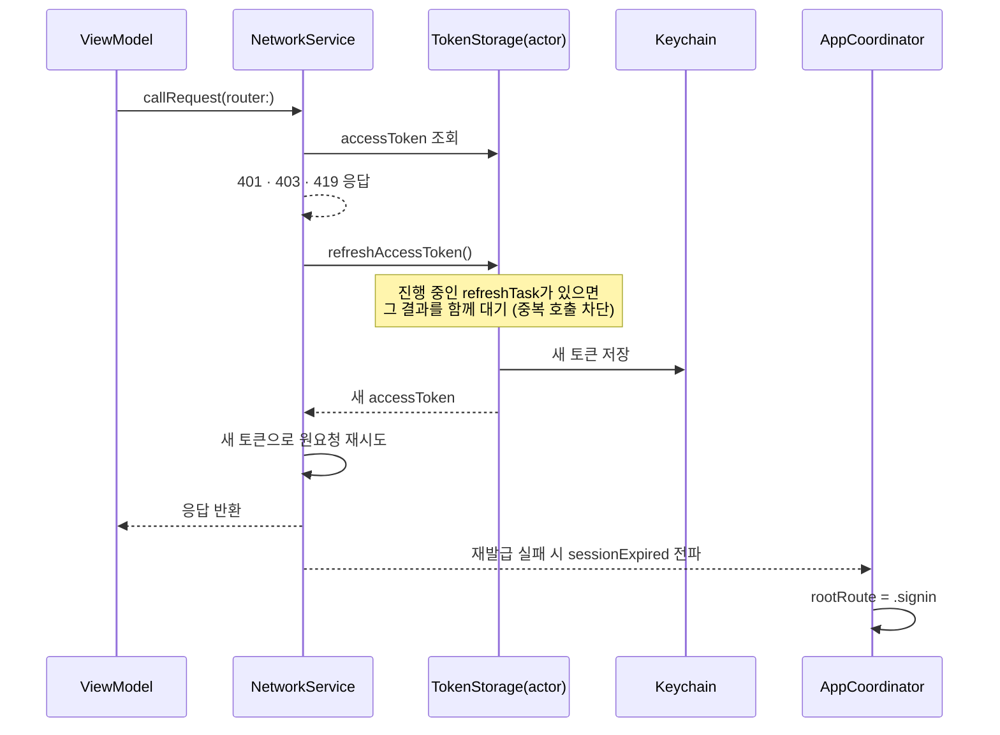
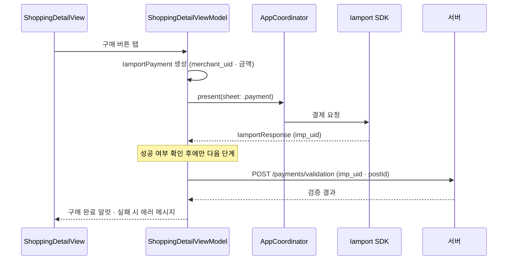
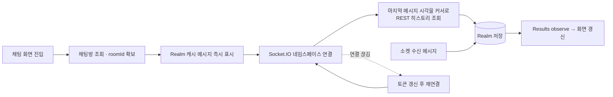

<div align="left">


# CONTEM

**C**ollect **O**nline **N**ew **T**rends **E**very **M**oment<br/>
매 순간 새로운 트렌드를 모으는 온라인 쇼핑 커머스 앱입니다.<br/>
상품 탐색·결제부터 스타일 피드·댓글·실시간 채팅까지 커머스의 전 흐름을 하나의 앱에 담았습니다.

</div>

---

- **개발 기간**: 2025.11–2025.12
- **개발 인원**: 2인 팀 프로젝트 (iOS)
- **최소 지원 버전**: iOS 16.0
- **개발 환경**: Xcode 26.1 / Swift / SwiftUI

---

## 기술 스택

### 📚 Frameworks & Libraries
      

### 🏗 Architecture & Core Setup
    

### 🌐 Network & Database
      

---

## 스크린샷

### 쇼핑

| 로그인 화면 | 상품 화면 | 상품 상세 화면 | 프로필 화면 |
|:---:|:---:|:---:|:---:|
|  |  |  |  |

### 스타일

| 스타일 화면 | 스타일 상세 화면 | 스타일 댓글 화면 |
|:---:|:---:|:---:|
|  |  |  |

---

## 핵심 기능

### 1. 로그인 · 세션

* 이메일 · 카카오(Kakao SDK) · 애플(`ASAuthorization`) 3종 로그인
* 애플 로그인은 `AppleAuthServiceType` · `AuthRepositoryType` 프로토콜로 주입해 ViewModel이 SDK를 직접 모르게 구성
* accessToken · refreshToken · userId를 Keychain에 저장하고 `TokenStorage` actor가 단독으로 관리
* 앱 진입 시 토큰 유무로 첫 화면(로그인 / 탭)을 분기

### 2. 쇼핑

* 카테고리 배너 무한 캐러셀
* 메인 카테고리 → 서브 카테고리 2단 필터
* 커서(`nextCursor`) 기반 페이지네이션으로 상품 목록 무한 스크롤
* 좋아요는 UI를 먼저 바꾸고(낙관적 업데이트) 0.5초 디바운스 후 1회만 서버에 전송

### 3. 상품 상세 · 결제

* 이미지 캐러셀, 아코디언 상세 정보, 사이즈 선택 바텀시트
* 브랜드 팔로우 · 브랜드 문의 채팅 진입
* 아임포트(Iamport) SDK 결제 → 성공 시 `imp_uid`로 서버 검증(`/payments/validation`)까지 완료해야 구매 확정
* 결제 화면은 `UIViewControllerRepresentable`(`PaymentBridge`)로 SwiftUI에 연결

### 4. 스타일 피드

* 2열 Masonry(워터폴) 레이아웃을 직접 구현해 높이가 제각각인 이미지를 배치
* 피드에 포함된 해시태그를 중복 제거해 상단 필터 칩으로 노출
* 커서 기반 페이지네이션 · 당겨서 새로고침 · 좋아요

### 5. 댓글

* 게시글 댓글 조회 · 작성 · 수정 · 삭제
* 이미지 첨부는 멀티파트로 먼저 업로드하고, 응답받은 경로를 본문에 실어 전송

### 6. 프로필 · 팔로우

* 내 프로필과 타인 프로필을 같은 화면으로 처리
* 팔로우 역시 낙관적 업데이트, 서버 실패 시 이전 상태로 롤백
* 작성한 스타일 피드 그리드 · 로그아웃

### 7. 실시간 채팅

* Socket.IO 네임스페이스 `/chats-{roomId}` 단위로 연결
* 수신 메시지는 Realm에 저장하고, 화면은 Realm `observe`로 갱신 (단일 진실 공급원)
* 로컬 마지막 메시지 시각을 커서로 REST 히스토리를 조회해 오프라인 중 누락분만 채움
* 소켓이 끊기면 토큰을 갱신한 뒤 자동 재연결
* 이미지 전송(멀티파트 업로드 후 경로 전송)

---

## 아키텍처

### MVVM-C + Input/Output



### 디렉토리

```
Contem/
├── App/          앱 진입점(ContemApp) · AppCoordinator
├── Manager/      KeychainManager · TokenStorage(actor) · RealmManager
├── Shared/
│   ├── Network/    도메인별 Router + DTO (Post · Chat · Auth · Payment · Follow · Comment · Profile)
│   ├── Services/   NetworkService · ChatSocketService · AppleAuthService
│   ├── Protocols/  ViewModelType · CoordinatorProtocol · TargetTypeProtocol
│   ├── Resource/   색 · 폰트 · 여백 · 라운드 · 그림자 · 투명도 토큰과 Assets
│   ├── DTOs/       공통 DTO
│   ├── Utils/      NetworkError · AuthRepository · ImageRequestModifier
│   └── Extension/  Image · String · Publisher 확장
└── Feature/      화면 단위 폴더 12개 (View / ViewModel / Model / Component)
```

---

## 핵심 아키텍처 패턴

### MVVM-C (Input/Output)
- 모든 ViewModel이 `ViewModelType` 프로토콜을 채택해 `Input` · `Output` 구조체와 `transform()` 단일 진입점을 갖습니다.
- View는 `input.xxx.send(...)`로만 신호를 보내고, `@Published var output` 하나만 구독합니다.

### Coordinator 패턴
- `AppCoordinator`가 `Route`(push) · `SheetRoute`(sheet) · `FullScreenSheetRoute`(fullScreenCover)를 enum으로 정의하고 화면 생성을 전담합니다.
- View는 화면 전환 코드를 갖지 않고 ViewModel이 `coordinator.push(_:)` · `present(sheet:)`를 호출합니다.
- 로그인 성공 · 세션 만료 시 `rootRoute`를 교체해 루트 화면을 전환합니다.

### Router 패턴 (URLSession)
- `TargetTypeProtocol`에 path · method · headers · parameters · multipartFiles · `hasAuthorization`을 정의하고, 기본 구현의 `asUrlRequest()`가 GET 쿼리 · JSON 바디 · 멀티파트 바디를 한곳에서 조립합니다.
- 도메인별 enum(`PostRequest` · `ChatRequest` · `PaymentRequest` · `UserRequest` 등)이 엔드포인트를 모아 관리합니다.

### 토큰 재발급 단일화
- `TokenStorage`를 `actor`로 두어 토큰 접근을 직렬화하고, 진행 중인 `refreshTask`를 재사용해 동시 401에도 재발급 요청이 1회만 나가도록 했습니다.
- `NetworkService`는 401 · 403 · 419 응답을 만나면 재발급 후 원요청을 자동 재시도하고, 재발급까지 실패하면 `sessionExpiredSubject`로 전역 로그아웃을 알립니다.

### 낙관적 업데이트 + 디바운스
- 좋아요 · 팔로우는 서버 응답을 기다리지 않고 UI를 먼저 갱신한 뒤, 별도 Subject에 `debounce`를 걸어 마지막 상태만 서버에 반영합니다. 실패 시 이전 상태로 롤백합니다.

### 로컬 캐시 (Realm)
- 채팅 메시지는 Realm이 단일 진실 공급원입니다. 소켓 수신과 REST 히스토리 모두 Realm에 쓰고, 화면은 `Results` 변경 알림만 구독합니다.

### 디자인 시스템 토큰화
- 색 · 폰트 · 여백 · 모서리 반경 · 그림자 · 투명도를 `Color` · `Font` · `CGFloat` 확장 토큰으로 고정하고, 색상은 Assets 기반이라 다크 모드에 자동 대응합니다.
- 화면 코드에 색상값 · 폰트 크기 · 매직 넘버를 직접 쓰지 않습니다.

### 의존성 주입
- ViewModel은 `coordinator`와 서비스 프로토콜을 이니셜라이저로 주입받고, 화면 조립은 `AppCoordinator`의 `build(route:)`에서만 수행합니다.

---

## 데이터 흐름

### 토큰 만료 → 자동 재발급 → 원요청 재시도



### 상품 결제



### 채팅 메시지 동기화



---

## 주요 기술

### SwiftUI + Combine
* 화면은 전부 SwiftUI로 구성하고, 상태 전달은 Combine `Subject` · `@Published`로 처리합니다.
* `throttle` · `debounce` · `withUnretained`로 중복 탭과 과도한 네트워크 호출을 제어합니다.

### Swift Concurrency
* 네트워크 · 소켓 · 저장소 호출은 `async/await` 기반입니다.
* 토큰 저장소는 `actor`로 데이터 경쟁을 차단하고, 병렬 요청은 `async let`으로 동시에 처리합니다.

### URLSession 네트워크 레이어
* 서드파티 없이 `URLSession` + Router로 네트워크 레이어 구성.
* 상태 코드 · 디코딩 · 연결 실패를 `NetworkError` · `StatusCodeError`로 분류해 사용자 문구까지 한곳에서 관리.

### Socket.IO + Realm
* 실시간 메시지는 Socket.IO, 영속화는 Realm이 담당.
* Realm 변경 알림을 구독해 소켓 · REST 어느 경로로 들어온 메시지든 동일하게 화면에 반영.

### Kingfisher
* 이미지 다운로드와 캐싱을 담당합니다.
* 인증이 필요한 이미지 URL을 위해 `ImageDownloadRequestModifier`로 헤더를 주입.

### Kakao SDK · AuthenticationServices
* 카카오 로그인과 애플 로그인을 처리하고, 발급받은 토큰을 서버 로그인으로 교환

### Iamport Payment SDK
* 카드 결제(PG: html5_inicis)를 처리하고 결제 후 서버 검증까지 연결

### Keychain
* accessToken · refreshToken · userId를 `KeychainManager`로 저장, 로그아웃 시 일괄 삭제
